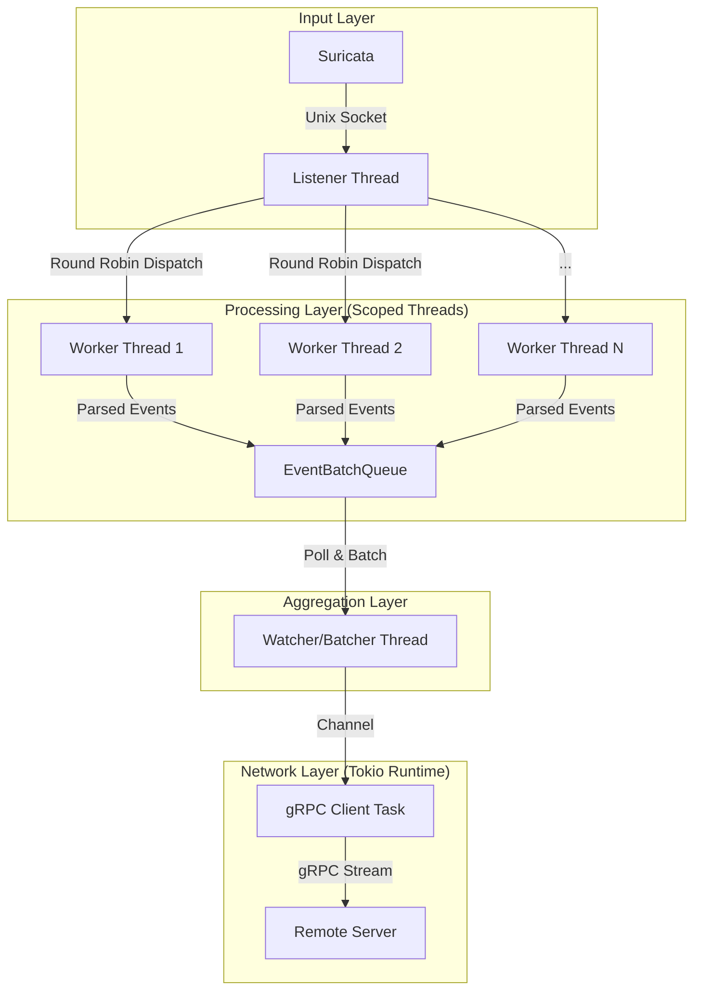

# Sensor Suricata Service (Rust)

A high-performance, multi-threaded Rust service designed to ingest Suricata EVE JSON logs from a Unix socket, parse them efficiently, and stream them to a central server via gRPC.

> [!NOTE]
> This is the **Rust implementation** of the **Mata Elang** sensor client. It is designed to replace the existing Go implementation with significantly improved performance and resource efficiency.

## 🚀 Performance Comparison

The following benchmarks were conducted using the `sensor-benchmark-tool` on the same hardware, measuring the end-to-end throughput (ingestion -> parsing -> batching -> gRPC transmission).

| Metric | Go Implementation | Rust Implementation | Improvement |
|--------|-------------------|---------------------|-------------|
| **Throughput** | ~23,000 events/sec | **~85,000 events/sec** | **~3.7x** |
| **Memory Usage** | ~423 MiB | **~65 MiB** | **~6.5x Lower** |
| **Architecture** | Goroutine | OS Threads + Async Runtime (Tokio) | Better CPU Utilization |

## 🚀 Architecture

This service employs a highly concurrent, pipelined architecture to maximize throughput and minimize latency. It separates I/O, CPU-intensive parsing, and network transmission into dedicated threads.



### Component Breakdown

1.  **Listener Thread (Blocking I/O)**
    *   Listens on a Unix Domain Socket.
    *   Accepts a single active connection from Suricata.
    *   Reads raw JSON lines and distributes them via Round-Robin to worker threads.
    *   **Goal**: Keep the socket buffer empty and distribute work as fast as possible.

2.  **Worker Threads (Parallel Processing)**
    *   **Scalability**: Spawns `N` threads (defaults to CPU core count).
    *   **Optimization**: Uses `simd-json` for extremely fast, in-place JSON parsing.
    *   **Logic**: Converts raw Suricata alerts into standardized `SensorEvent` Protobuf messages.
    *   **Output**: Pushes processed events into a shared, thread-safe `EventBatchQueue`.

3.  **EventBatchQueue (Aggregation)**
    *   A shared in-memory buffer protected by a `Mutex`.
    *   Supports time-based or size-based batching.
    *   Uses `std::mem::take` or efficient swapping strategies to minimize lock contention during batch extraction.

4.  **Watcher/Batcher Thread**
    *   Runs in a tight loop (polling every 10ms).
    *   Extracts batches of events from the queue.
    *   Sends batches to the async gRPC client via a bounded channel.

5.  **gRPC Client (Async/Tokio)**
    *   Runs on the Tokio runtime (separate from the worker threads).
    *   Handles the persistent gRPC connection to the backend server.
    *   Streams batches of data efficiently.

## ⚡ Performance Features

*   **Memory Allocator**: Uses `jemalloc` (`tikv-jemallocator`) for superior memory fragmentation handling and performance in multi-threaded environments.
*   **SIMD JSON**: Leverages `simd-json` to parse logs significantly faster than standard `serde_json`.
*   **Lock Contention Reduction**:
    *   Metrics use `AtomicI64` with `Relaxed` ordering for zero-locking overhead.
    *   Batch processing swaps entire data structures to minimize the time the queue lock is held.

## 🛠️ Usage

### Build
```bash
cargo build --release
```

### Run
```bash
./target/release/sensor-suricata-service-rust \
  --file /var/run/suricata/suricata.json \
  --server http://localhost:50051 \
  --sensor-id sensor-01
```

### Configuration Flags
| Flag | Description | Default |
|------|-------------|---------|
| `-f, --file` | Path to Suricata Unix socket | `suricata.sock` |
| `-s, --server` | gRPC Server URL | `http://[::1]:50051` |
| `-p, --port` | gRPC Server Port | `50051` |
| `-i, --interval` | Batch interval in seconds | `1` |
| `--sensor-id` | Unique ID for this sensor | `default-sensor` |
| `-k, --max-clients` | Number of worker threads | `CPU Cores` |
| `-v` | Verbosity level (-v, -vv, -vvv) | Info |
